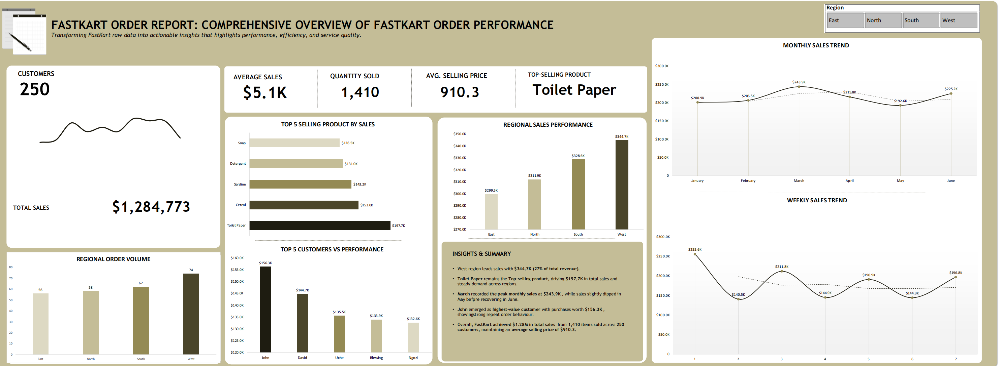

# FastKart-Order-Report
This project explores the performance and efficiency of Fast Kart's order and delivery operations using **Excel**.  
It provides a clear view of key metrics such as delivery time, order volume, and revenue trends.

## 📊 Dashboard Overview
The dashboard visualizes:
- Order Duration and Delivery Speed  
- Top Performing Regions  
- Revenue and Order Trends  

## 🧰 Tools & Techniques
- **Excel Pivot Tables**  
- **Pivot Charts**  
- **Slicers for Interactive Filtering**  

## 💡 Insights
- Identified regions with the fastest delivery turnaround  
- Highlighted order patterns that influence revenue growth  
- Improved understanding of customer satisfaction through delivery performance  

## 📈 Outcome
A simple, data-driven Excel dashboard that helps track operational efficiency and business growth.

